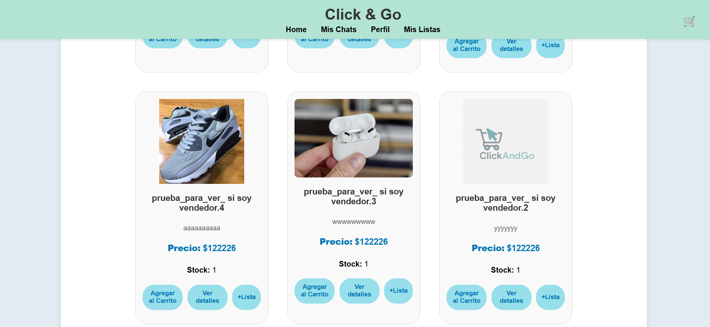
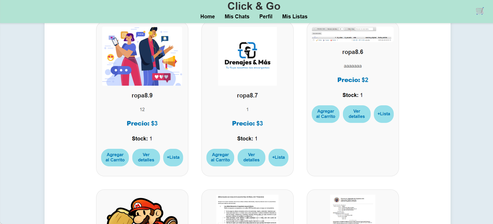
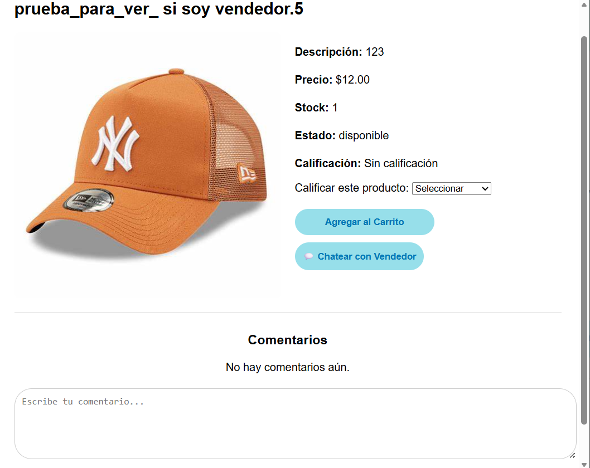
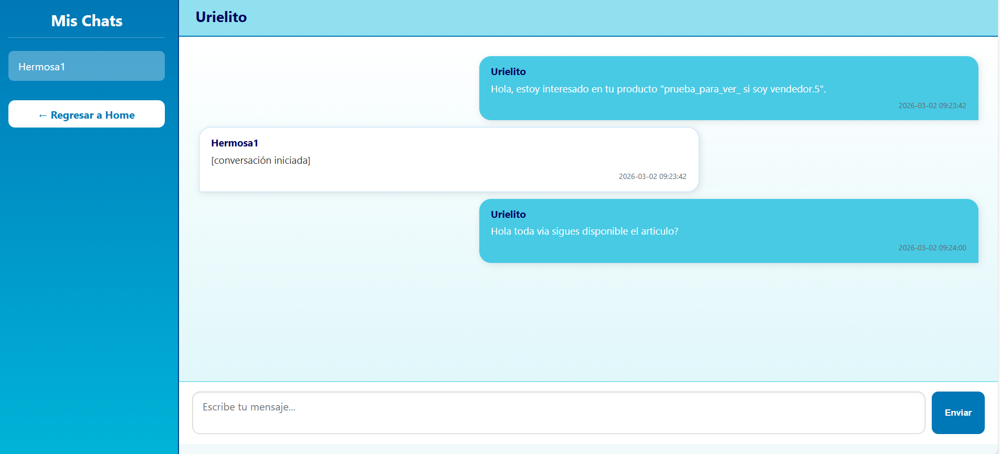
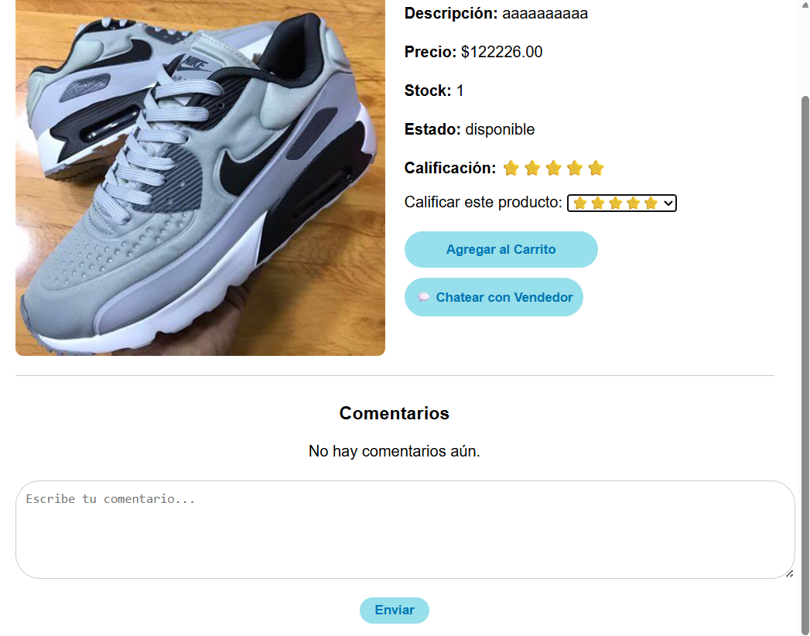
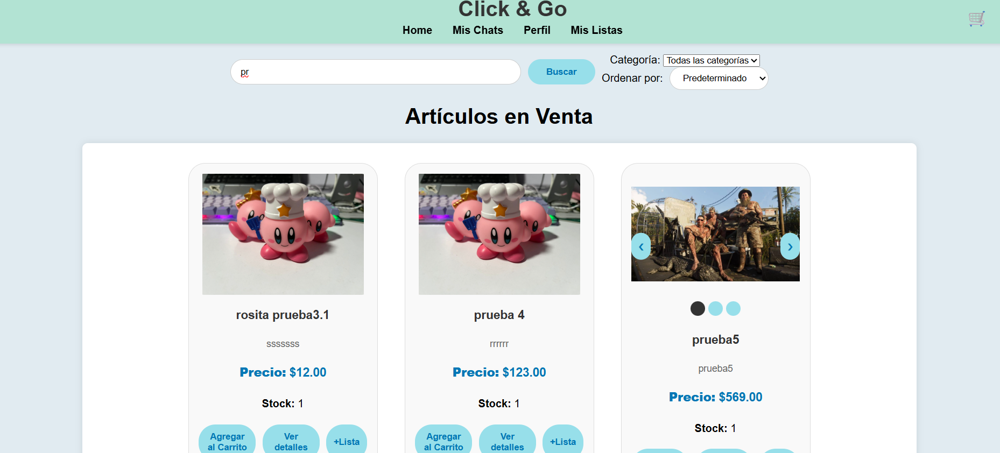
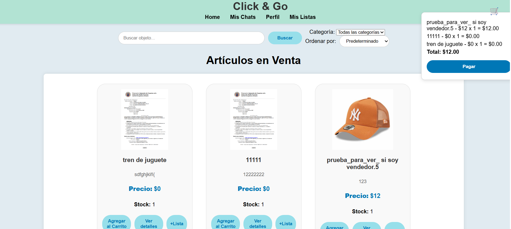
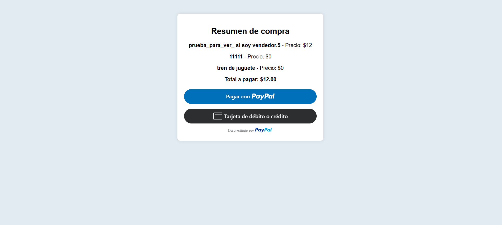
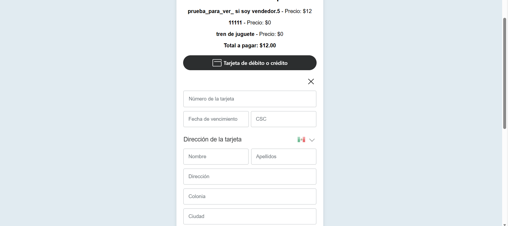

# Sistema Web de Publicación de Productos

Proyecto desarrollado con PHP, MySQL y Bootstrap que permite a los usuarios publicar productos y a un administrador aprobarlos antes de mostrarlos en la página principal.

## Funcionalidades

- Registro e inicio de sesión de usuarios
- Publicación de productos con imágenes
- Sistema de aprobación por administrador
- Filtro por categorías
- Sistema de comentarios
- Chat entre comprador y vendedor
- Envío de cotizaciones dentro del chat

## Tecnologías utilizadas

- PHP
- MySQL
- phpMyAdmin
- HTML5
- CSS3
- Bootstrap
- JavaScript

## Base de Datos

El proyecto utiliza una base de datos relacional con tablas como:

- Usuario
- Producto
- Categoria
- Multimedia
- Comentarios
- Chats

## Capturas del Sistema

### Página Principal

  
  

### Panel de Comentarios

  

### Sistema de Chat

  

### Sistema de calificacion 

  

### Video de sistema de busqueda 

### Sistema de Carrito Funcional

  

### Sistema de pago 

  
    

## Instalación

1. Clonar el repositorio
2. Importar la base de datos en phpMyAdmin
3. Configurar el archivo de conexión
4. Ejecutar en XAMPP

---

## 👨‍💻 Autor

Uriel Almaguer
